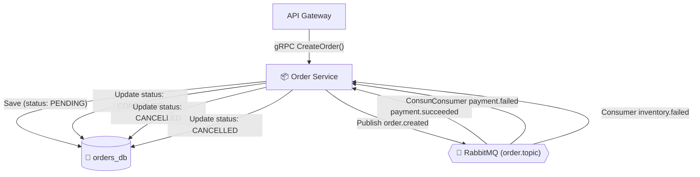

<div align="center">

# 📦 Hermex Order Service
### Order Lifecycle Management & Saga Initiator

[ **English** ] &nbsp;•&nbsp; [ [Українська](README.ua.md) ] &nbsp;•&nbsp; [ [System Overview](../overview/README.md) ]

<p align="center">
  gRPC Transport (:50051) &bull; PostgreSQL (orders_db) &bull; Saga Initiator &bull; Prometheus Metrics (:3001)
</p>

</div>

> **Order Service** is the central order management microservice and the **Saga Initiator** for distributed transactions.  
> It operates exclusively over internal gRPC (with no public HTTP endpoints), isolates its domain data in `orders_db`, and coordinates order lifecycles from submission (`PENDING`) through confirmation (`CONFIRMED`) or cancellation (`CANCELLED`).

---

## 🏛️ Saga Choreography & Role

The service serves as the initiator of the order Saga: persists incoming orders and publishes initial events to RabbitMQ, while consuming downstream terminal events:



### Order Lifecycle (`OrderStatus`):
- `PENDING` (Order stored, waiting for stock reservation and payment capture)
- `CONFIRMED` (Stock reserved, payment captured successfully)
- `CANCELLED` (Warehouse out of stock or payment declined)

---

## 📜 gRPC Interface (`order.proto`)

```protobuf
syntax = "proto3";

package hermex.order;

service OrderGrpcService {
  rpc CreateOrder (CreateOrderRequest) returns (CreateOrderResponse);
  rpc GetOrderById (GetOrderByIdRequest) returns (OrderMessage);
  rpc CancelOrder (CancelOrderRequest) returns (CancelOrderResponse);
}
```

### RPC Methods:
1. **`CreateOrder`:** Accepts `userId`, `items` (array of `productId`, `quantity`, `price`), customer info, and shipping details. Persists the order as `PENDING` and emits `order.created`.
2. **`GetOrderById`:** Fetches order details and nested items by UUID.
3. **`CancelOrder`:** Explicitly cancels an order with a reason code.

---

## 🐇 RabbitMQ Topology & Event Consumers

- **Emitted Events:**
  - Exchange: `order.topic`
  - Routing Keys: `order.created`, `order.cancelled`, `order.expired`
- **Consumed Events:**
  - `payment.succeeded` (from `payment.topic`) ➔ Transitions order to `CONFIRMED`.
  - `payment.failed` (from `payment.topic`) ➔ Transitions order to `CANCELLED`.
  - `inventory.failed` (from `inventory.topic`) ➔ Transitions order to `CANCELLED`.
- **Dead Letter Handling:**
  - Poison messages that fail 3 consecutive times route to `hermex.dlx` ➔ `hermex.dead.letter.queue`.

---

## 🐘 Data Model (`orders_db`)

- **Table `orders` (`OrderEntity`):**
  - `id`: UUID (Primary Key)
  - `userId`: UUID (Order owner)
  - `status`: Enum (`PENDING`, `CONFIRMED`, `CANCELLED`)
  - `totalAmount`: Decimal (Total order sum in UAH)
  - `currency`: String (`UAH`)
  - `shippingAddress`: JSONB
  - `cancelReason`: String (Nullable)
  - `createdAt`, `updatedAt`: Timestamps
- **Table `order_items` (`OrderItemEntity`):**
  - `id`: UUID (Primary Key)
  - `orderId`: UUID (Foreign Key to `orders`)
  - `productId`: UUID
  - `productTitle`: String
  - `quantity`: Integer
  - `unitPrice`: Decimal (in UAH)

---

## 📊 Telemetry & Prometheus Metrics

Initialized as a **NestJS Hybrid Application**:
- gRPC server listens on `:50051`.
- Internal HTTP server listens on `:3001` for Prometheus scraping:
  - `GET /metrics`
  - Metrics: `hermex_orders_total`, `hermex_saga_duration_seconds`, `hermex_order_grpc_requests_total`.
- End-to-end tracing is propagated via `TraceContext` and `GrpcTraceInterceptor`.

---

## ⚙️ Environment Variables (`.env`)

| Variable | Type | Default | Description |
| :--- | :---: | :---: | :--- |
| `GRPC_PORT` | number | `50051` | gRPC listening port |
| `METRICS_PORT` | number | `3001` | Prometheus scraping port |
| `DB_HOST` | string | `localhost` | PostgreSQL host |
| `DB_PORT` | number | `5432` | PostgreSQL port |
| `DB_USERNAME` | string | `hermex` | PostgreSQL user |
| `DB_PASSWORD` | string | `hermex_secret_pwd`| PostgreSQL password |
| `DB_DATABASE` | string | `orders_db` | Database name |
| `RABBITMQ_URL` | string | `amqp://...` | AMQP connection URL |

---

## 🛠️ Run & Deployment

```bash
# Install dependencies
bun install

# Start development mode
bun run start:dev

# Launch containerized service
docker compose up -d --build
```
