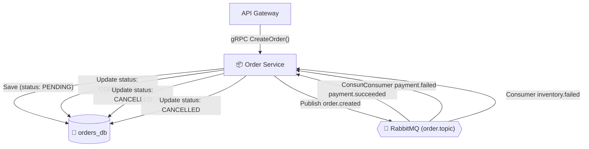

<div align="center">

# 📦 Hermex Order Service
### Керування замовленнями та ініціатор розподіленої Saga

[ [English](README.md) ] &nbsp;•&nbsp; [ **Українська** ] &nbsp;•&nbsp; [ [Головний огляд](../overview/README.ua.md) ]

<p align="center">
  Транспорт gRPC (:50051) &bull; PostgreSQL (orders_db) &bull; Ініціатор Saga &bull; Метрики Prometheus (:3001)
</p>

</div>

> **Order Service** — головний мікросервіс керування замовленнями та **ініціатор розподіленої Saga (Saga Initiator)**.  
> Сервіс працює виключно за внутрішнім протоколом gRPC (без публічних HTTP-портів), ізольований у базі даних `orders_db` та керує життєвим циклом замовлення від створення (`PENDING`) до успішного підтвердження (`CONFIRMED`) або скасування (`CANCELLED`).

---

## 🏛️ Роль у Saga та хореографія подій

`Order Service` є відправною точкою Saga: зберігає замовлення та публікує первинну подію у RabbitMQ, а також слухає фінальні результати від інших сервісів:



### Життєвий цикл замовлення (`OrderStatus`):
- `PENDING` (Очікує резервування залишків та проведення оплати)
- `CONFIRMED` (Товар зарезервовано, кошти успішно списано)
- `CANCELLED` (Товар відсутній або платіж відхилено)

---

## 📜 gRPC Контракт (`order.proto`)

```protobuf
syntax = "proto3";

package hermex.order;

service OrderGrpcService {
  rpc CreateOrder (CreateOrderRequest) returns (CreateOrderResponse);
  rpc GetOrderById (GetOrderByIdRequest) returns (OrderMessage);
  rpc CancelOrder (CancelOrderRequest) returns (CancelOrderResponse);
}
```

### RPC-методи:
1. **`CreateOrder`:** Приймає `userId`, список товарів `items`, контакти та адресу доставки. Зберігає замовлення у статусі `PENDING` та публікує подію `order.created`.
2. **`GetOrderById`:** Повертає повні дані про замовлення та його позиції за UUID.
3. **`CancelOrder`:** Скасування замовлення із фіксацією причини.

---

## 🐇 Топологія черг та подій RabbitMQ

- **Події, що публікуються:**
  - Обмінник: `order.topic`
  - Routing Keys: `order.created`, `order.cancelled`, `order.expired`
- **Події, що прослуховуються:**
  - `payment.succeeded` (з `payment.topic`) ➔ Замовлення переходить у `CONFIRMED`.
  - `payment.failed` (з `payment.topic`) ➔ Замовлення переходить у `CANCELLED`.
  - `inventory.failed` (з `inventory.topic`) ➔ Замовлення переходить у `CANCELLED`.
- **Dead Letter Handling:**
  - Повідомлення з помилками після 3 спроб пересилаються в `hermex.dlx` ➔ `hermex.dead.letter.queue`.

---

## 🐘 Модель даних (`orders_db`)

- **Таблиця `orders` (`OrderEntity`):**
  - `id`: UUID (Primary Key)
  - `userId`: UUID (Власник замовлення)
  - `status`: Enum (`PENDING`, `CONFIRMED`, `CANCELLED`)
  - `totalAmount`: Decimal (Сума замовлення в гривнях)
  - `currency`: String (`UAH`)
  - `shippingAddress`: JSONB
  - `cancelReason`: String (Nullable)
  - `createdAt`, `updatedAt`: Timestamps
- **Таблиця `order_items` (`OrderItemEntity`):**
  - `id`: UUID (Primary Key)
  - `orderId`: UUID (Зовнішній ключ на `orders`)
  - `productId`: UUID
  - `productTitle`: String
  - `quantity`: Integer
  - `unitPrice`: Decimal (в гривнях)

---

## 📊 Спостережуваність та метрики Prometheus

Мікросервіс працює як **NestJS Hybrid Application**:
- gRPC сервер слухає порт `:50051`.
- Внутрішній HTTP сервер на порті `:3001` віддає метрики:
  - `GET /metrics`
  - Метрики: `hermex_orders_total`, `hermex_saga_duration_seconds`, `hermex_order_grpc_requests_total`.
- Наскрізне трасування підтримується через `TraceContext` та `GrpcTraceInterceptor`.

---

## ⚙️ Змінні оточення (`.env`)

| Змінна | Тип | За замовчуванням | Опис |
| :--- | :---: | :---: | :--- |
| `GRPC_PORT` | number | `50051` | Порт gRPC-сервера |
| `METRICS_PORT` | number | `3001` | Порт метрик Prometheus |
| `DB_HOST` | string | `localhost` | Хост PostgreSQL |
| `DB_PORT` | number | `5432` | Порт PostgreSQL |
| `DB_USERNAME` | string | `hermex` | Користувач бази даних |
| `DB_PASSWORD` | string | `hermex_secret_pwd`| Пароль бази даних |
| `DB_DATABASE` | string | `orders_db` | База даних замовлень |
| `RABBITMQ_URL` | string | `amqp://...` | Рядок підключення до RabbitMQ |

---

## 🛠️ Запуск мікросервісу

```bash
# Встановлення залежностей
bun install

# Запуск у режимі розробки
bun run start:dev

# Запуск у Docker Compose
docker compose up -d --build
```
